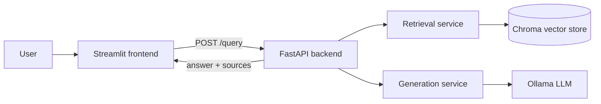

# 📚 Drug Document Assistant Chatbot

> Ask questions about **<Drugs>** documents and get grounded answers with cited sources — running fully locally with Ollama.

## Overview
This project is a Retrieval-Augmented Generation (RAG) web app. Documents are cleaned, split into chunks, embedded and stored in a Chroma vector database (built in a notebook). A FastAPI backend retrieves the most relevant chunks for a question and asks a local LLM (Ollama) to answer **using only that context**, citing its sources. A Streamlit chat UI sits on top.

## Architecture



## Tech stack
Python 3.10+ · pypdf · sentence-transformers (all-MiniLM-L6-v2) · ChromaDB · Ollama (llama3.2) · FastAPI · Pydantic · Streamlit · pytest · Docker

## Project structure
```
rag-assistant-app/
├── notebooks/rag_pipeline.ipynb   # build + evaluate the RAG pipeline
├── backend/                       # FastAPI app (+ tests, Dockerfile)
│   ├── app/ ...
│   └── data/vector_store/         # produced by the notebook
├── frontend/                      # Streamlit chat UI
├── data/raw/                      # source documents (not committed)
└── README.md
```

## Domain & data
<Data for Drugs and Pharmacies, DAILYMED, Download them using DailyMed download pdf.>

## Setup

### 1. Prerequisites
Python 3.10+, Git, and [Ollama](https://ollama.com). Then pull the model:
```bash
ollama pull llama3.2
```

### 2. Clone & install
```bash
git clone https://github.com/<your-username>/rag-assistant-app.git
cd rag-assistant-app
python -m venv .venv
# Windows:  .venv\Scripts\activate
# macOS/Linux:  source .venv/bin/activate
pip install -r backend/requirements.txt -r frontend/requirements.txt
```

### 3. (Optional) Rebuild the vector store
A ready-made vector store is included in `backend/data/vector_store/`. To rebuild it, put your documents in `data/raw/`, `pip install jupyter pandas pypdf tabulate`, open `notebooks/rag_pipeline.ipynb` and run all cells.

### 4. Run the backend
```bash
cd backend
cp .env.example .env        # Windows: copy .env.example .env
uvicorn app.main:app --reload
```
Open http://localhost:8000/docs to try the API.

### 5. Run the frontend (new terminal)
```bash
cd frontend
cp .env.example .env        # Windows: copy .env.example .env
streamlit run app.py
```
Open http://localhost:8501.

### 6. Run the tests
```bash
cd backend
pytest
```

## Environment variables

| Variable | Where | Default | Description |
|---|---|---|---|
| `OLLAMA_HOST` | backend | `http://localhost:11434` | URL of the Ollama server |
| `OLLAMA_MODEL` | backend | `llama3.2` | Ollama model used to generate answers |
| `TOP_K` | backend | `4` | Number of chunks retrieved per question |
| `MIN_SCORE` | backend | `0.25` | Minimum similarity; below it the assistant says "not found" |
| `ALLOWED_ORIGINS` | backend | `http://localhost:8501,...` | CORS: allowed frontend origins (comma-separated) |
| `LOG_LEVEL` | backend | `INFO` | Logging level |
| `API_BASE_URL` | frontend | `http://localhost:8000` | Where the frontend finds the backend |

## API reference

| Method | Path | Description |
|---|---|---|
| GET | `/health` | Health check |
| POST | `/query` | Ask a question |

**Request**
```bash
curl -X POST http://localhost:8000/query \
  -H "Content-Type: application/json" \
  -d '{"question": "<a question about your documents>"}'
```

**Response**
```json
{
  "answer": "… [1]",
  "sources": ["[1] my_file.pdf (page 3)"]
}
```
Invalid input (missing/too short `question`) returns **422**. If Ollama is down the API returns **503**.

## Evaluation results
<Paste the table printed by the notebook (section 6) and 3–4 sentences about failure cases and mitigations.>

| question | retrieved_source | answer | grounded | correct |
|---|---|---|---|---|
| … | … | … | … | … |


## Docker (backend)
```bash
cd backend
docker build -t rag-backend .
docker run -p 8000:8000 --add-host=host.docker.internal:host-gateway rag-backend
```

## Author
<Ahmed Niazy> — DrugAssist Chatbot

